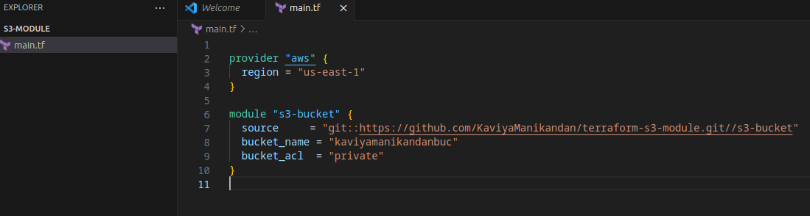
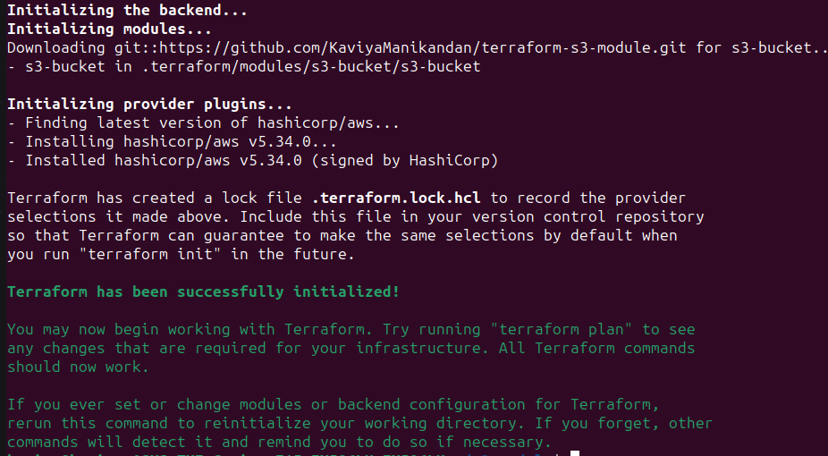
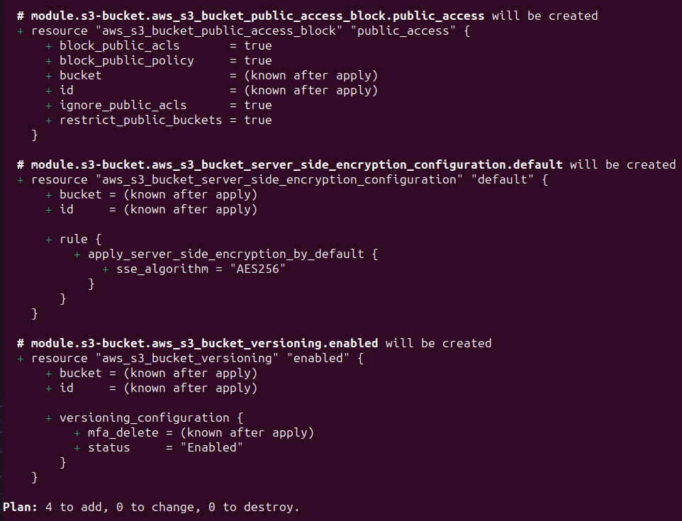
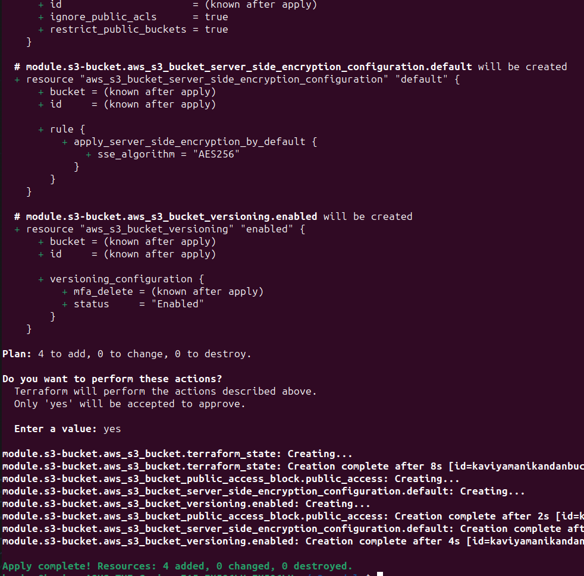
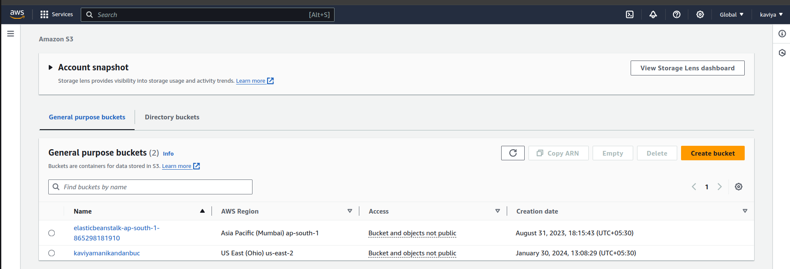
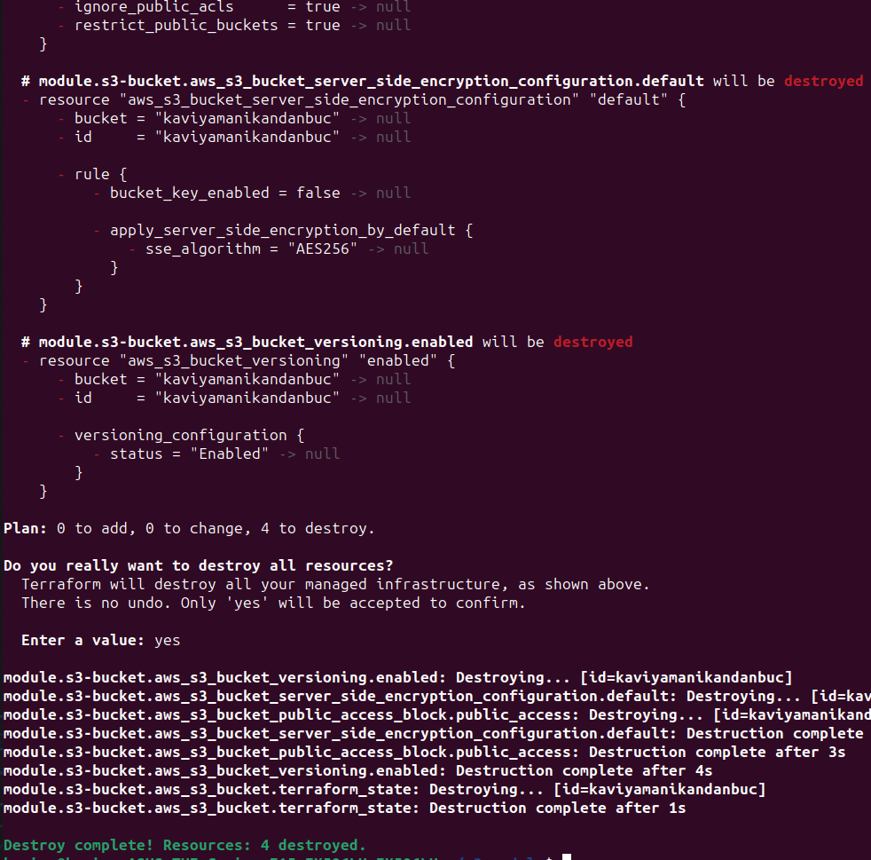

## Step by Step guide to Create a Terraform module that deploys an S3 bucket on AWS.

## Purpose of the module
-It easily helps to set up Amazon S3 storage buckets in your Terraform projects.

-You can specify bucket details like its name, who can access it, and if versioning is enabled.

-It makes managing AWS storage simpler and more consistent across your projects.

-With this module, you can quickly create secure and reliable storage for your applications and data on AWS.

## Prerequisites
-AWS account access.

-Terraform installed.

## Step 1: Copy the Module: 

```hcl

provider "aws" {
  region = "us-east-1"
}

module "s3-bucket" {
  source     = "git::https://github.com/KaviyaManikandan/terraform-s3-module.git//s3-bucket"
  bucket_name = "kaviyamanikandanbuc"
  bucket_acl  = "private"
}

```
## Step 2 : Save in a Folder: 

-Create a folder for your Terraform configuration files. 

-Inside this folder, create a main.tf file where you'll use the module. 




## Step 3 : Open the terminal

Navigate to the directory where the main.tf file is located (the folder you created in step 2)

## Step 4 : Terraform Initialization

Run the following command to initialize Terraform in your working directory:

```
terraform init
```



## Step 5 : Review the Execution Plan

Generate and review the Terraform execution plan before applying changes:

```
terraform plan
```



## Step 6 : Apply Changes

Apply the Terraform configuration to create the S3 bucket:

```
terraform apply
```



Step 7 : Verify Resources

Navigate to the AWS Management Console and verify that the S3 bucket is created with the desired configurations.



Step 8 : Cleanup (Optional)

If you no longer need the resources created by Terraform, you can destroy them using the following command:

```
terraform destroy
```



## Author

- [Kaviya](https://github.com/KaviyaManikandan)

